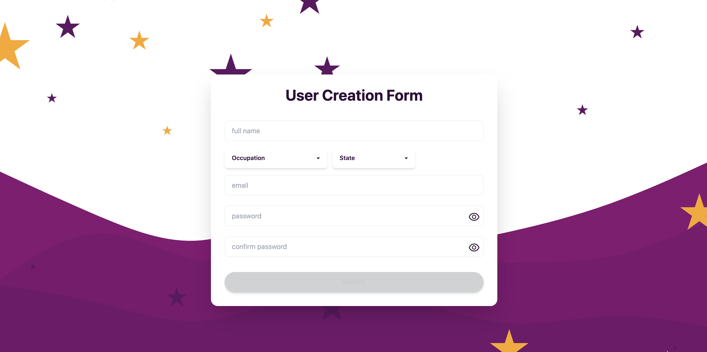
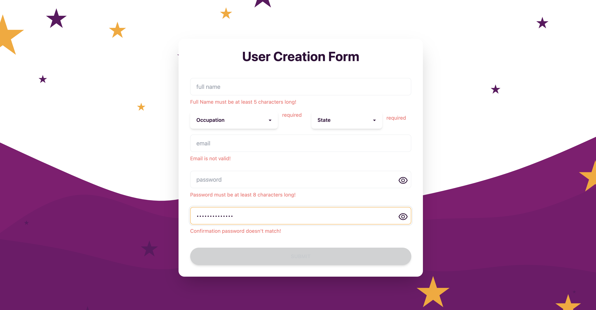
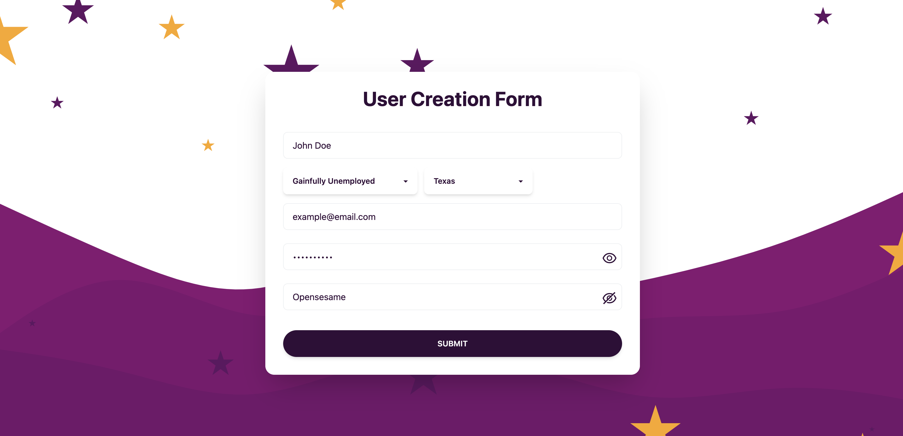
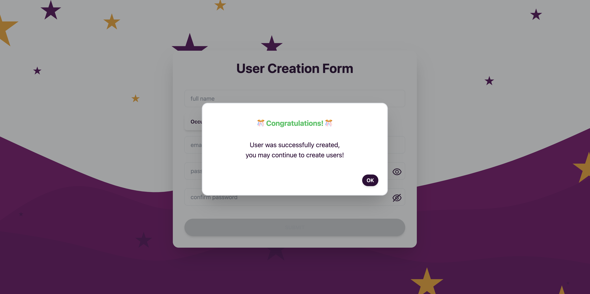

## `How` to run the app:
1. npm install
2. npm run start

## `What` does the app do:
This `User Creation Form` does just that.
It is a single page site that allows users to create users.
Pulling and mapping through data from an endpoint provided to render options for two select inputs - `occupation` and `state`. The app has on-change form validation for all inputs on the form which upon filling out correctly will enable the submit button allowing users to submit the form. The submit handler triggers a POST request to the same endpoint and if successful the user will recieve a pop-up success message.

**Empty form**

**Form errors**

**Form filled correctly**

**Success message**

## `How` to setup locally:

## `Technologies` used
- React
- TailwindCSS
    - DaisyUI

## `Minimum` Requirements
The site must:

1. Display a form with inputs for each field outlined
2. Allow a user to complete and submit the form
3. Do not allow form submission without completing the entire form
4. Provide feedback upon successful form submission

## `Added` Features

1. On-change form validation
2. Confirm password field
3. View password icon toggle
4. User cannot multi-click submit button
5. reset state upon successful submit
6. Mobile responsive

